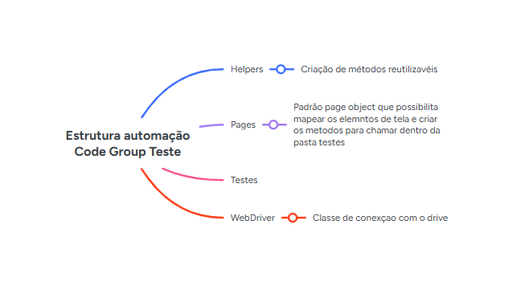
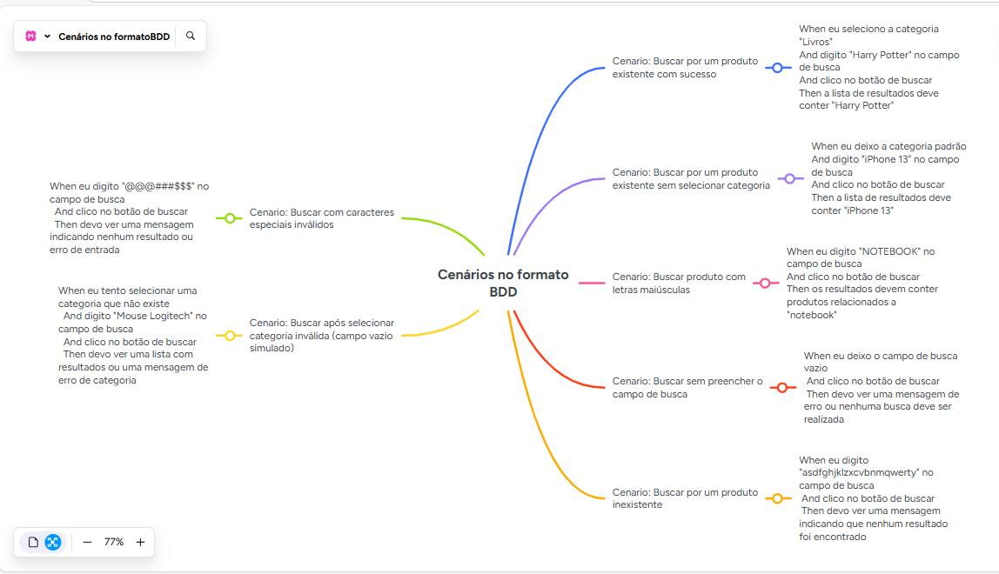
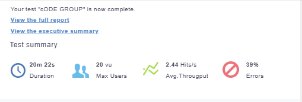
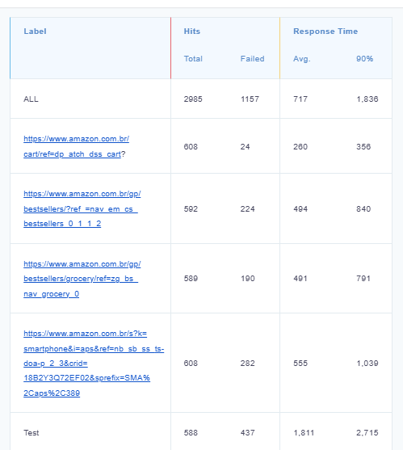

**Automação**

### Pré requisitos

* maven -> gerenciador de dependências
* java 11 -> linguagem utilizada

### Executando os teste pela IDE

* Pode ser encontrado no pacote suits um arquivo chamado DesafioRunnerTestbasta executa-lo como JUnit Test. 

### Executando os teste por linha de comado
* mvn test -DTest=DesafioRunnerTest

**Mapa mental automação**

**Cenários de testes**

> * Scenario: Buscar por um produto existente com sucesso
    When eu seleciono a categoria "Livros"
    And digito "Harry Potter" no campo de busca
    And clico no botão de buscar
    Then a lista de resultados deve conter "Harry Potter"

> *  Scenario: Buscar por um produto existente sem selecionar categoria
    When eu deixo a categoria padrão
    And digito "iPhone 13" no campo de busca
    And clico no botão de buscar
    Then a lista de resultados deve conter "iPhone 13"

> *  Scenario: Buscar produto com letras maiúsculas
    When eu digito "NOTEBOOK" no campo de busca
    And clico no botão de buscar
    Then os resultados devem conter produtos relacionados a "notebook"

> *  Scenario: Buscar sem preencher o campo de busca
    When eu deixo o campo de busca vazio
    And clico no botão de buscar
    Then devo ver uma mensagem de erro ou nenhuma busca deve ser realizada

> *  Scenario: Buscar por um produto inexistente
    When eu digito "asdfghjklzxcvbnmqwerty" no campo de busca
    And clico no botão de buscar
    Then devo ver uma mensagem indicando que nenhum resultado foi encontrado

> *  Scenario: Buscar com caracteres especiais inválidos
    When eu digito "@@@###$$$" no campo de busca
    And clico no botão de buscar
    Then devo ver uma mensagem indicando nenhum resultado ou erro de entrada

> *  Scenario: Buscar após selecionar categoria inválida (campo vazio simulado)
    When eu tento selecionar uma categoria que não existe
    And digito "Mouse Logitech" no campo de busca
    And clico no botão de buscar
    Then devo ver uma lista com resultados ou uma mensagem de erro de categoria

**Mapa mental cenários em BDD**

**Relatório teste de perfomance**

### Dados iniciais do teste de perfomance

### Resultado do testes 

**Considerações finais **

* Site apresenta boa usabilidade, porém poderia melhorar a performance 

### Autor

* Alecsandro
